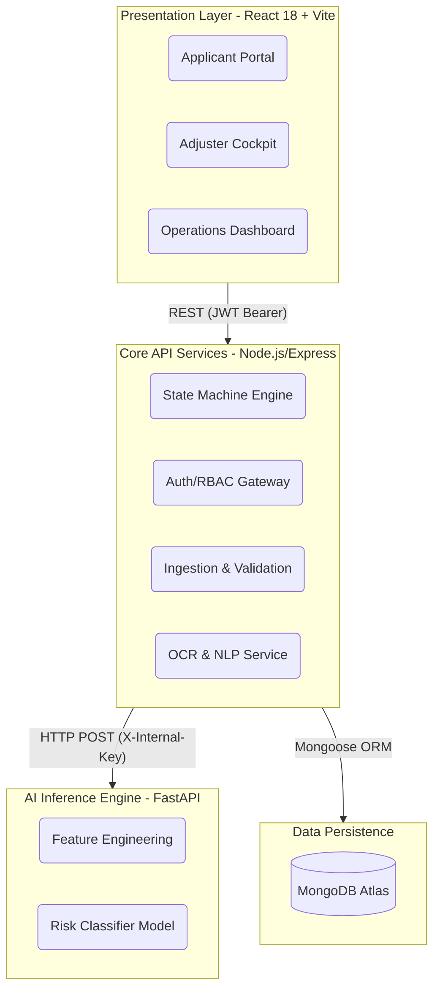

# ClaimPilot: Enterprise-Grade Automated Claims Adjudication Platform

ClaimPilot is an AI-powered, full-stack microservices architecture designed to automate and triage insurance claims adjudication. Built for scale, security, and real-time processing, the platform integrates robust document extraction (OCR), NLP-driven entity parsing, and a high-performance machine learning risk classification pipeline (APPROVE / REJECT / ESCALATE). 

It features strict multi-tenant data isolation, role-based access control (RBAC), and human-in-the-loop review cockpits for claims adjusters.

---

## 🏛️ System Architecture

ClaimPilot implements a decoupled microservices architecture prioritizing horizontal scalability, fault tolerance, and security boundaries.



### Core Components
* **Frontend**: React 18, Vite, Tailwind CSS. Role-based routing (Admin, Adjuster, Claimant) with real-time entity cards and polling.
* **Backend API**: Node.js, Express. Features hardened security (Helmet, rate-limiting), Multer-based MIME-validated uploads (10MB ceiling), and a robust localized OCR pipeline (Tesseract.js + Sharp).
* **AI Inference Service**: FastAPI-based Python microservice running on an internal network bind (`127.0.0.1:8001`). Exposes a hyperparameter-optimized Random Forest risk classification model trained on a 20-feature engineered schema.
* **Database**: MongoDB (Mongoose ORM) with strict tenant and claimant data isolation at the query level.

---

## 🛠️ Environment Prerequisites

To run this stack locally, ensure the following tools are provisioned:
* **Node.js**: `v18.0.0+` (Tested on LTS v24.x)
* **npm**: `v9.0.0+`
* **Python**: `v3.10+` (Tested on `v3.11`/`v3.14`)
* **MongoDB**: Active local instance (`localhost:27017`) or Atlas URI.

---

## 🚀 Local Development Guide

Follow these sequential steps to boot the entire platform from source.

### 1. Environment Configuration
Initialize the `.env` configuration from the provided templates:
```bash
cp .env.example .env
cp backend/.env.example backend/.env
```

Ensure `backend/.env` is configured correctly for your local MongoDB instance and defines the internal microservice secrets:
```env
PORT=5000
MONGO_URI=mongodb://localhost:27017/claimpilot
JWT_SECRET=claimpilot_supersecret_jwt_key_2026_production_min32chars
ML_SERVICE_URL=http://127.0.0.1:8001
ML_INTERNAL_KEY=claimpilot-internal-secret-2026
```

### 2. Bootstrapping the AI Inference Service
The ML pipeline requires a dedicated Python virtual environment.

Open Terminal 1:
```bash
# Navigate to the ML subsystem
cd ml

# Provision the virtual environment
python -m venv venv

# Activate (Windows PowerShell):
.\venv\Scripts\Activate.ps1
# Activate (Unix): source venv/bin/activate

# Install required numerical computing and ML libraries
pip install -r requirements.txt

# Run the end-to-end data pipeline:
# 1. Preprocess raw data (generates processed_claims.csv)
# 2. Train and serialize the Random Forest model
# 3. Perform hyperparameter tuning and model QA audit
python preprocess.py
python train.py
python audit.py

# Boot the FastAPI inference server on the internal loopback
python inference_server.py
```
*Wait for the server to report: `Uvicorn running on http://127.0.0.1:8001`*

### 3. Bootstrapping the Core API
Open Terminal 2:
```bash
cd backend
npm install
npm run dev
```
*The backend will automatically seed required admin/verifier accounts on startup.*

### 4. Bootstrapping the Frontend Client
Open Terminal 3:
```bash
cd frontend
npm install
npm run dev
```
Navigate to `http://localhost:5173` in your browser.

---

## 🐳 Containerized Deployment (Docker)

For a production-ready, isolated container network featuring built-in health checks and orchestrated startup sequences:

```bash
docker-compose up --build
```

**Exposed Services:**
* **Frontend UI**: `http://localhost:80` (Proxied via Nginx)
* **Backend API**: `http://localhost:5000`
* **ML Inference**: `http://127.0.0.1:8001` (Internal binding only)
* **MongoDB**: `localhost:27017`

---

## 🧪 Integration & Resilience Testing

The platform includes a comprehensive, automated testing suite (Jest + Supertest) designed to validate end-to-end business logic and failure recovery.

```bash
cd backend
npm test
```

**Test Coverage Highlights:**
1. **Authentication:** Validates JWT generation and RBAC authorization headers.
2. **End-to-End Adjudication:** Simulates a complete claim submission, triggering real OCR extraction and ML inference, asserting SLA transitions out of the `DOCUMENTS_PROCESSING` state.
3. **Graceful Degradation:** Simulates a catastrophic ML microservice failure (downtime/timeout) and asserts the backend successfully catches the error and degrades gracefully to a `MANUAL_REVIEW_REQUIRED` state.
4. **Data Isolation:** Enforces strict claimant boundaries, ensuring users cannot access or leak cross-tenant claims.
5. **Input Validation:** Simulates adversarial inputs (corrupted PDFs, missing required payloads) to assert robust HTTP 400 responses without crashing the Node.js event loop.

---

## 🛡️ Security Posture & Compliance

ClaimPilot is engineered with strict security-by-default principles:

1. **Multi-Tenant Data Sovereignty**: Document queries enforce strict `{ claimantId: req.user.id }` filtering to prevent horizontal privilege escalation.
2. **Local Data Processing**: By utilizing Tesseract.js and locally hosted ML models, sensitive PII/PHI (Aadhaar cards, Medical Certificates) is processed entirely within the local cluster boundaries. Zero data is egressed to third-party cloud APIs (e.g., AWS Textract / Google Vision API).
3. **Hardened Ingestion Pipeline**: File uploads are protected against malicious payloads via strict MIME-type and magic-number validation (via `Multer`), enforcing a hard 10MB ceiling to mitigate DDOS vectors.
4. **Microservice Network Security**: The ML inference service binds strictly to the `127.0.0.1` loopback interface and mandates a secure `X-Internal-Key` header, preventing external network access to the prediction API.
5. **Sanitized Version Control**: The repository leverages `git-filter-repo` to guarantee that all sensitive test images and historical credentials have been permanently scrubbed from the git tree.
