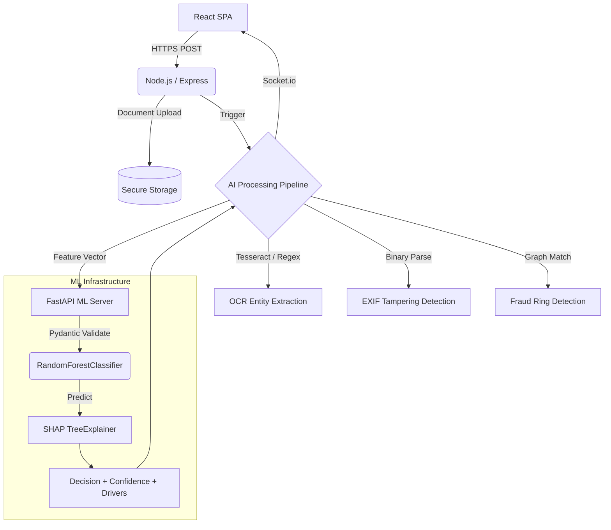

# ClaimPilot: Intelligent Claims Adjudication Ecosystem


ClaimPilot is an enterprise-grade, end-to-end AI adjudication pipeline designed to automate insurance claim triage. By bridging deterministic rule-engines with stochastic Machine Learning models and Explainable AI (XAI), the system reliably classifies claims into `APPROVE`, `ESCALATE`, or `REJECT` workflows while maintaining a rigid human-in-the-loop fallback mechanism.

## 🧠 AI Engineering Architecture

The ecosystem heavily decouples the ML Inference pipeline from the core transactional backend, allowing for independent scaling and stateless execution.



### 1. Model Lifecycle & Triage (scikit-learn)
The core decision engine is driven by a highly tuned `RandomForestClassifier`. 
* **Handling Imbalance:** The training pipeline leverages **SMOTE** (Synthetic Minority Over-sampling Technique) to handle the extreme class imbalance typically found in insurance datasets (where fraudulent claims are the vast minority).
* **Feature Engineering:** We map highly dimensional raw OCR data down into a 20-dimensional feature vector, encoding categorical data (e.g., `claim_type`) and engineering compound ratios (e.g., `amount_vs_policy_limit_ratio`).

### 2. Explainable AI (SHAP)
Black-box models are unacceptable in regulated fintech/insurtech. The Inference Server integrates **SHAP (SHapley Additive exPlanations)** via `TreeExplainer`. On every prediction, the server computes the exact marginal contribution of each feature and returns the top 3 driving factors (e.g., *"amount_requested (25000) increased risk score"*), displaying them directly in the Adjuster's Cockpit.

### 3. Multi-Modal Fraud Detection
Beyond standard text analysis, the pipeline operates on the metadata layer of submitted evidence:
* **EXIF Forgery Detection:** Binary parsing of JPG/PNG headers to detect modified software (e.g., Adobe Photoshop) or asynchronous timestamp modifications between `DateTimeOriginal` and `ModifyDate`.
* **Fraud Ring Topologies:** Deterministic checks within the NoSQL persistence layer for abnormal clustering (e.g., a single identity requesting rapid consecutive high-value settlements).

### 4. Resilient Inference (FastAPI)
The ML Server exposes endpoints bound to `127.0.0.1` and protected by internal API keys (`X-Internal-Key`). Incoming payloads are strictly validated using `Pydantic` schemas to prevent data drift or malformed tensor shapes from crashing the worker threads.

---

## 🚀 Bootstrapping the Ecosystem

### Prerequisites
- **Python 3.10+** (for ML Inference)
- **Node.js 18+** (for Backend/Frontend)
- **MongoDB** (Local or Atlas)

### Step 1: ML Inference Server
Navigate to the `ml/` directory and initialize the python environment.
```bash
cd ml
python -m venv venv
venv\Scripts\activate      # Windows
# source venv/bin/activate # Linux/Mac

pip install -r requirements.txt
python train.py            # Generates risk_model.pkl and feature_columns.json
python inference_server.py # Starts FastAPI on port 8001
```

### Step 2: Orchestration Backend
Open a new terminal.
```bash
cd backend
npm install
# Ensure .env is configured (PORT=5000, MONGO_URI=...)
npm run dev
```

### Step 3: Frontend UI
Open a third terminal.
```bash
cd frontend
npm install
npm run dev
```

## 🧪 MLOps & QA

An automated end-to-end pipeline test (`ml/tests/qa_pipeline.py`) continuously verifies:
1. Model prediction latency & fallback parameters.
2. Pydantic malformed payload rejections.
3. OCR regex alignment against synthetic baseline strings.
4. Edge cases (all zeros, excessive limit ratios, NaN injection).

## 🛡️ Data Governance
* No `.env` files, `.pkl` models, or raw `.webp` PII documents are ever committed to the repository (enforced via strict `.gitignore` and `git-filter-repo` sanitization).
* Synthetic data generation (`generate_synthetic_data.py`) handles model training bootstrapping without relying on raw PII.
