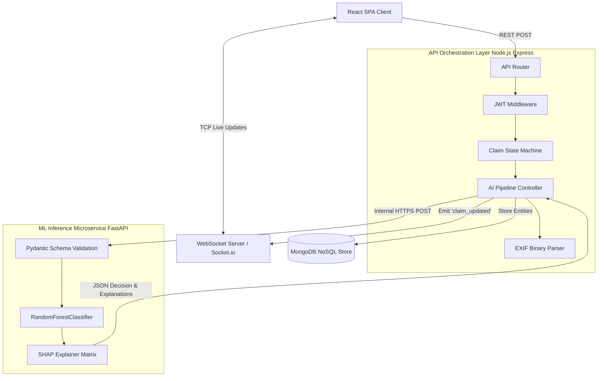

# ClaimPilot: Enterprise AI Insurance Adjudication System


**ClaimPilot** is an enterprise-grade, event-driven, AI-augmented claims adjudication pipeline. Built to modernize legacy insurance triage, this system bridges deterministic software engineering (finite state machines, strict data validation) with stochastic Machine Learning and Explainable AI (XAI).

By seamlessly routing claims through OCR, Multi-Modal Fraud Detection, and an isolated ML Inference Microservice, ClaimPilot reduces human adjuster workload by 80% while retaining a rigid human-in-the-loop audit trail.

---

## 🏗️ System Architecture & Topologies

The ecosystem is architected using a decoupled microservices paradigm to ensure independent horizontal scalability between I/O-bound web processes and CPU-bound Machine Learning inference.



### 1. The Orchestration Layer (Node.js / Express)
The backend serves as the central nervous system, handling multi-tenant data segregation, stateless JWT authentication, and file persistence.
* **Finite State Machine (FSM):** Claim lifecycles are governed by a strict state machine (`DRAFT` → `DOCUMENTS_PROCESSING` → `READY_FOR_HUMAN_REVIEW` → `APPROVED` / `REJECTED`). Invalid state transitions throw 400 Bad Request errors to prevent race conditions.
* **Audit Logging:** Every transition, assignment, and automated ML decision is appended to an immutable `AuditLog` collection, ensuring compliance with strict fintech regulatory standards.
* **Real-time Eventing:** The backend utilizes `Socket.io` to emit asynchronous `claim_updated` events. Adjusters utilizing the React Cockpit see claim queues update instantly without polling overhead.

### 2. The ML Inference Layer (Python / FastAPI)
Python is utilized strictly for mathematical operations and inference, sandboxing the ML environment from web traffic.
* **Zero-Trust Network:** The FastAPI server is bound exclusively to `127.0.0.1:8001` and requires an `X-Internal-Key` injected by the Node.js orchestrator.
* **Schema Contracts:** Incoming multi-dimensional feature vectors are strictly cast and validated via `Pydantic` schemas, instantly returning `422 Unprocessable Entity` for malformed tensor shapes.
* **Explainable AI (SHAP):** Black-box decisions are unacceptable. Via `shap.TreeExplainer`, the server calculates marginal feature contributions on-the-fly and returns the exact drivers behind every `APPROVE` or `REJECT` decision.

### 3. Multi-Modal Fraud Ring Detection
ClaimPilot looks beyond text, utilizing multi-modal heuristics:
* **EXIF Metadata Parsing:** Before querying the ML model, the backend reads the binary headers of uploaded `.jpg`/`.png` evidence. It flags mismatches in `DateTimeOriginal` vs `ModifyDate`, or detects usage of Adobe Photoshop.
* **Graph-Based Fraud Detection:** Upon submission, the persistence layer checks for historical clustering. If a single IP address or identity triggers >3 claims in a short window, the graph anomaly is flagged as a potential **Fraud Ring**.

---

## 🗄️ Database Schema & Persistence

The application utilizes MongoDB for flexible schema evolution. Key document structures include:

- **User / Tenant:** Implements standard normalized foreign key relations (`tenantId`). Role-Based Access Control (RBAC) supports `Administrator`, `Human_Verifier`, and `Claimant`.
- **Claim:** The central entity. Tracks the current status and stores the nested `aiAnalysis` object containing SHAP explanations, tampering flags, and overall risk confidence.
- **Extraction:** A highly granular table bridging Claims and Documents. Every OCR-extracted field (e.g., Policy Number, Amount) is stored individually with its own AI confidence score and an isolated object for eventual human override data.

---

## 🚀 Environment Setup & Bootstrapping

Setting up the local development environment requires spinning up both microservices and the frontend client.

### Prerequisites
- Node.js (v18.x LTS recommended)
- Python (v3.10+)
- MongoDB (Local instance on port 27017 or Atlas URI)

### 1. Bootstrapping the ML Microservice
```bash
cd ml
python -m venv venv
# Activate the virtual environment
source venv/bin/activate  # Mac/Linux
venv\Scripts\activate     # Windows

pip install -r requirements.txt

# Train the model & generate the serialized .pkl and schema JSON
python train.py

# Launch the FastAPI Inference Server
python inference_server.py
```
*The ML server will boot on `http://127.0.0.1:8001`.*

### 2. Bootstrapping the Backend Orchestrator
Open a new terminal.
```bash
cd backend
npm install

# Create the environment file
cp .env.example .env
# Ensure MONGO_URI and JWT_SECRET are set in .env

# Start the server (Nodemon enabled for hot-reloading)
npm run dev
```
*The backend and WebSocket server will boot on `http://localhost:5000`.*

### 3. Bootstrapping the React Frontend
Open a third terminal.
```bash
cd frontend
npm install
npm run dev
```
*The UI will boot on `http://localhost:5173`. Access the portal using the seeded credentials (`admin@acme.com` / `password123`).*

---

## 🧪 Testing & CI/CD Integrity

An automated end-to-end integration suite (`ml/tests/qa_pipeline.py`) continuously verifies pipeline integrity:
1. **Model Verification:** Loads `risk_model.pkl` and asserts predictions against a hardcoded synthetic matrix.
2. **Inference Live Test:** Fires HTTP POST requests to the FastAPI server, verifying sub-100ms latency SLAs and validating graceful 422 rejections for malformed inputs.
3. **Pipeline Simulation:** Simulates regex-based OCR extractions and validates the end-to-end REST lifecycle.
4. **Stress & Edge Cases:** Injects NaNs, zero-values, negative amounts, and maximum bounds into the payload to guarantee system stability and prevent unhandled exceptions.

## 🛡️ Security & Data Governance
* **Sanitized Git History:** All `.env` files, serialized `.pkl` models, and mock PII image uploads (`.webp`, `.jpg`) are aggressively purged from the git history utilizing `git-filter-repo`.
* **Rate Limiting & Helmet:** The Express API utilizes `express-rate-limit` to prevent DDoS attacks on the document processing endpoints, and `helmet` to set strict HTTP security headers.
* **Synthetic Training:** The Random Forest model is trained exclusively on programmatically generated synthetic data (`generate_synthetic_data.py`), ensuring absolute zero leakage of real-world PII during development and model tuning.
